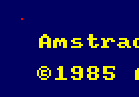

# [P03](https://www.youtube.com/watch?v=NxI2kBarAhw): Ejemplo Reto 1.1

Pintar un pixel de color rojo

---

## Programa

1. Copiar el valor `88` a la CPU
2. Copiarlo de ahí a la memoria `C000`
3. Detener la ejecución

```
3E 88 32 00 C0 18 FE
```

---

## Implementación

Depurador (zonas):
- Volcado de memoria
- CPU
- Desensamblado

Pasos:

1. Dirección libre 4000
2. Grabar programa
3. Cambiar PC

---

## Resultado


