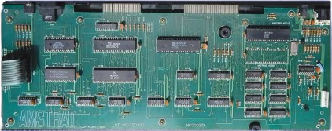
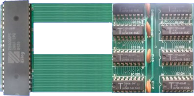
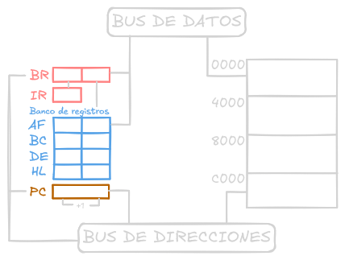

# [T01](https://www.youtube.com/watch?v=p8DeOFI-CKE): Ciclo de Ejecución de la CPU

Vamos a ver cómo funciona el z80.

## Partes internas

## Conexión directa

Hay 24 líneas que permiten enviar 24 bits de información en cada instante de tiempo.

* Bus de datos (8 bits)
* Bus de direcciones (16 bits)

## Ciclo de la CPU

Lo que hace desde que se arranca.

## Explicación del ejercicio 1.1

